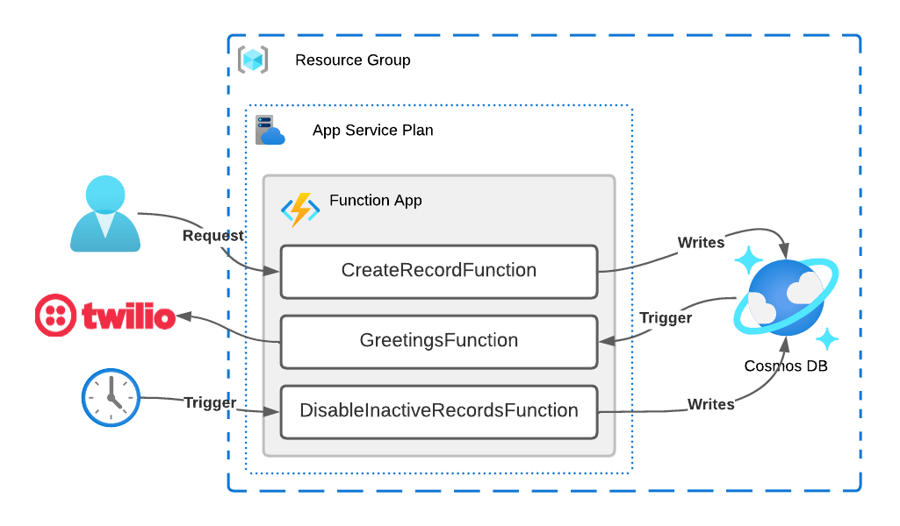

# Azure Serverless

A Lab to explore serverless offerings on Azure

## Implementation



The lab run as:

1. `CreateRecordFunction` exposing a HTTP Endpoint is triggered sending `Person` data;
2. `GreetingsFunction` is triggered as Cosmos DB collection receives the new data and send a greeting SMS via Twillio;
3. Every minute, `DisableInactiveRecordsFunction` is called to mark records older than 5 minutes as disabled;
4. As CosmosDb collection changes, `GreetingsFunction` is triggered again, but sending another message;

## Local Configuration

You`ll need:

- Cosmos DB NoSQL API Instance;
- Twillio Account, with SMS messaging configured

You`ll also need a running Azurite instance to test Time triggered functions locally.

Configs should be set in `local.settings.json` inside `src/backend/RecorderFunctions` folder as follows:

```json
{
  "IsEncrypted": false,
  "Values": {
    "AzureWebJobsStorage": "UseDevelopmentStorage=true",
    "FUNCTIONS_WORKER_RUNTIME": "dotnet",
    "CosmosDbConnection": "<Your Cosmos DB Conn String>",
    "TwillioAccountSid": "<Your Twillio Account SID>",
    "TwillioAuthToken": "<Your Twillio Account Token>"
  }
}
```

## Running

### Azurite

```sh
$ docker run -p 10000:10000 -p 10001:10001 -p 10002:10002 mcr.microsoft.com/azure-storage/azurite
```

### Functions App

```sh
# '~' is used to represent the project`s root folder
$ cd ~/src/backend/RecorderFunctions
$ func start --verbose
```

## Dependencies

- [.NET 6](https://dotnet.microsoft.com/download)
- [Azure Functions Core Tools 4.0](https://docs.microsoft.com/en-us/azure/azure-functions/functions-run-local#install-the-azure-functions-core-tools)
- [Azure CLI 2.40](https://learn.microsoft.com/en-us/cli/azure/install-azure-cli)
- [Docker](https://docs.docker.com/get-docker/) / [Rancher Desktop](https://rancherdesktop.io) (running dockerd)
- [Azurite](https://github.com/Azure/Azurite) Docker Image
- [Free Azure Account](https://azure.microsoft.com/free/) _(services used in this lab aren`t free)_
